# Description
An app for songs and song's chords.
Core is written in rust. GUI is written with flutter.

**The project is still under active development so it can have some bugs!**

# Main features
- All songs are just Yaml files in folders (for Android library root folder is Android/data/com.kiber_bomzh.songbook/files/songbook/library, for Windows and Linux look [here](https://docs.rs/dirs/latest/dirs/fn.data_dir.html))
- There's versions for Windows, Linux and Android and their data is fully compatible
- Strong data typing for content of a song (Song is a list of Blocks and each Block has an optional title, an optional note and a list of lines. And each line can be: Row, Tab, PlainText, ChordsLine, NoteLine, EmptyLine)
- Powerful song editor (maybe it's a little weird but you'll get used to it)
- Autoscroll
- Key transposition
- Capo support
- App theming (accent color, custom fonts, custom colors for each song element, custom background image for the app and other settings)

# Screenshots
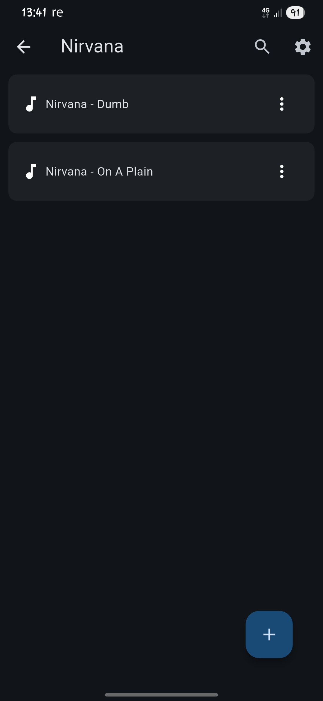
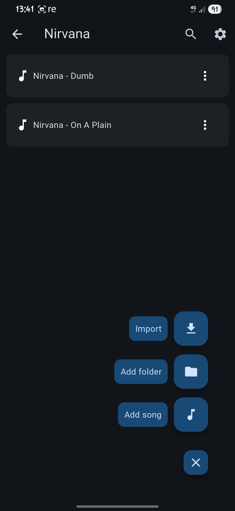
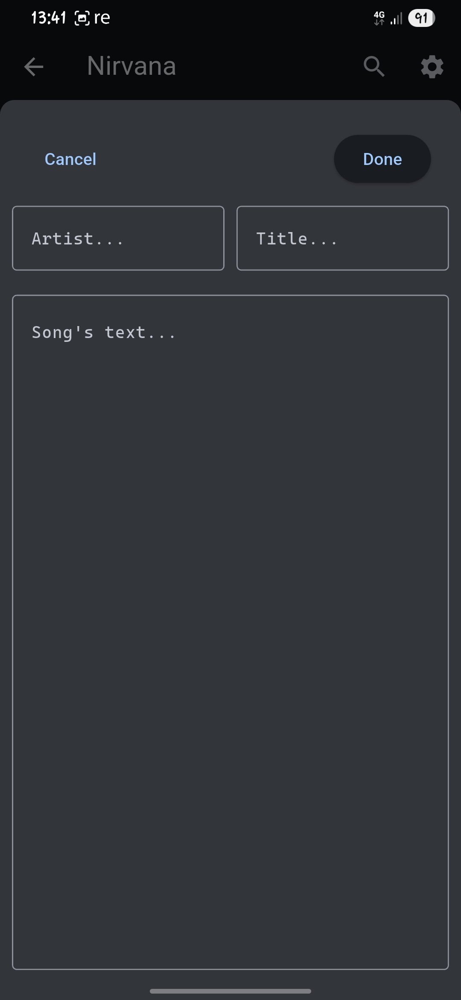
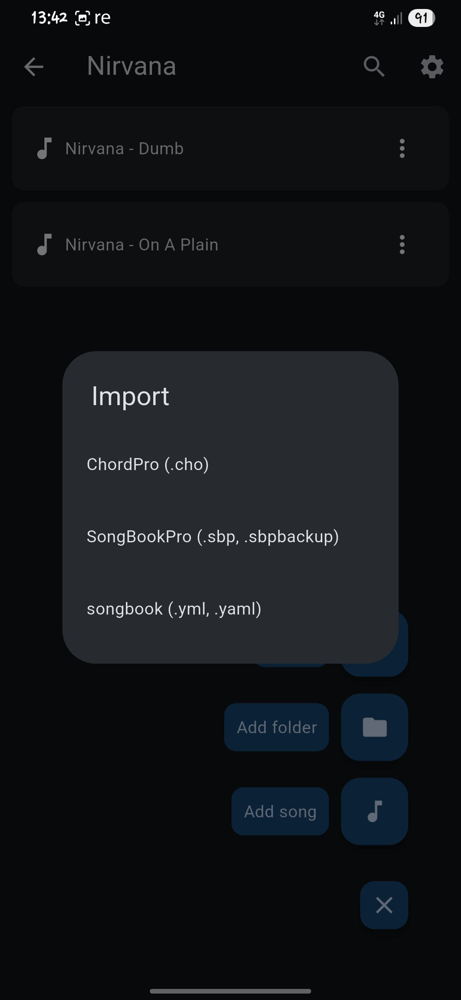
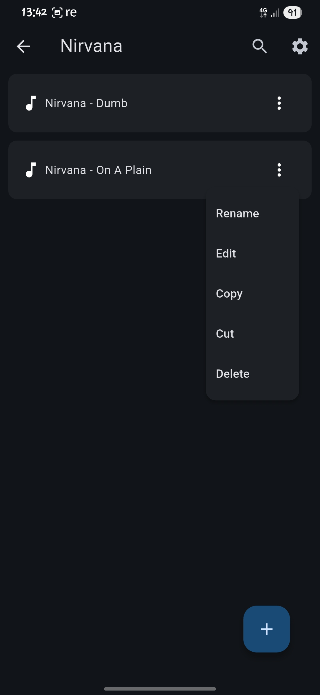
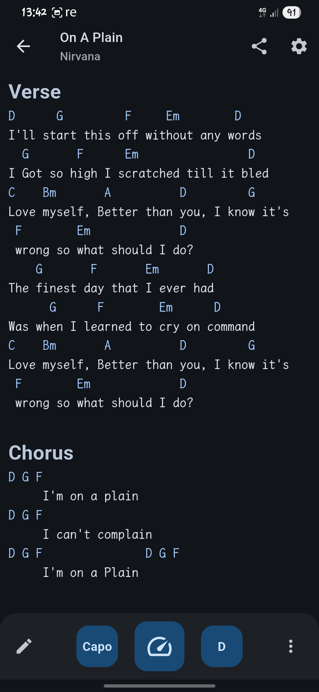
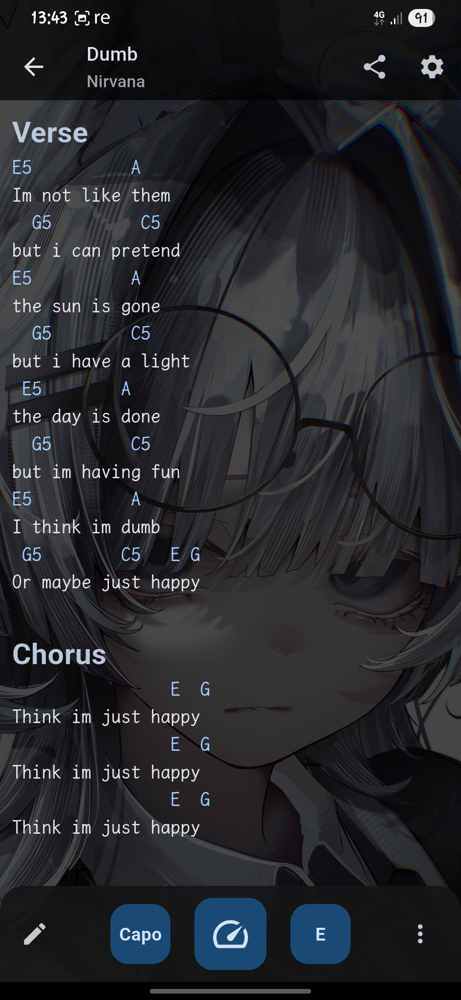
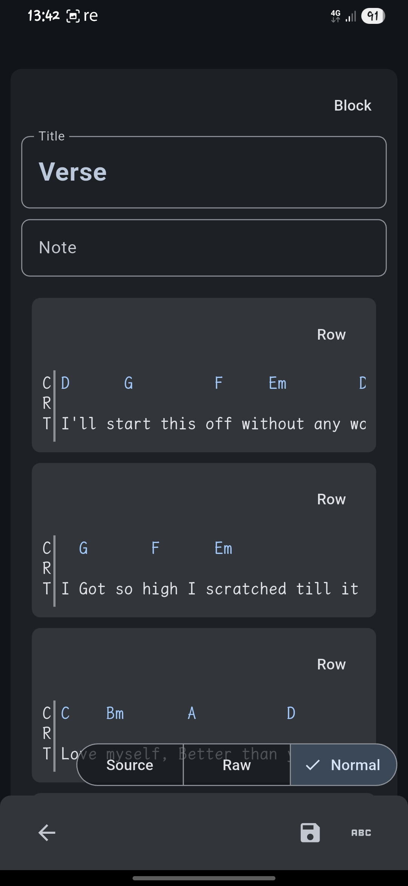
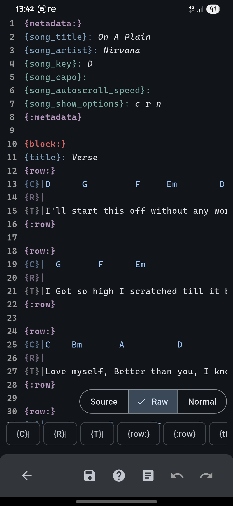
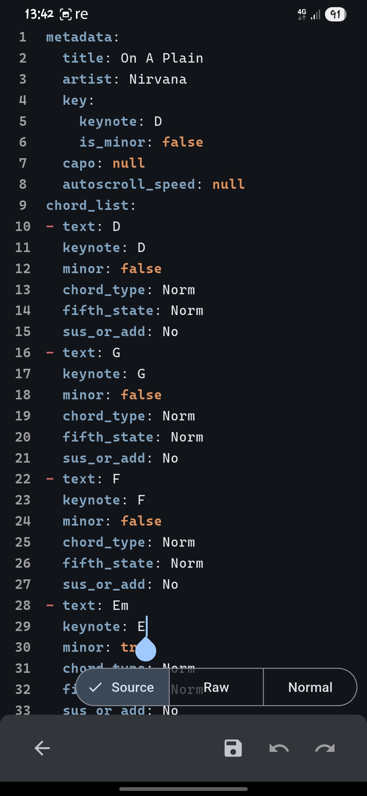
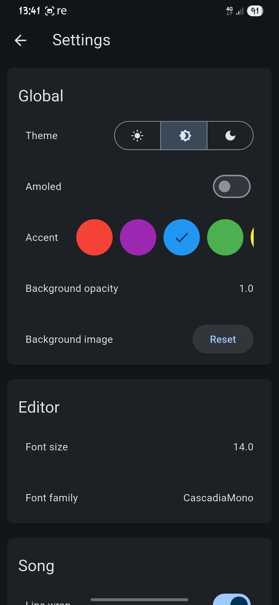
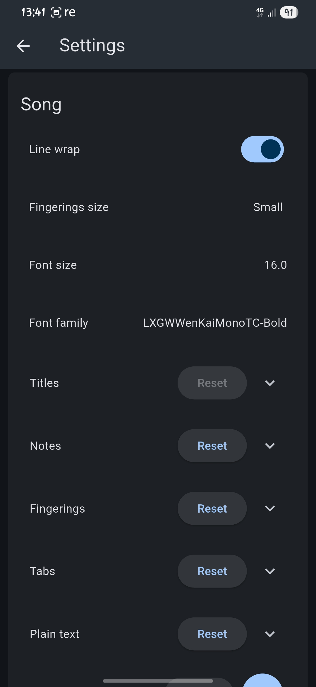
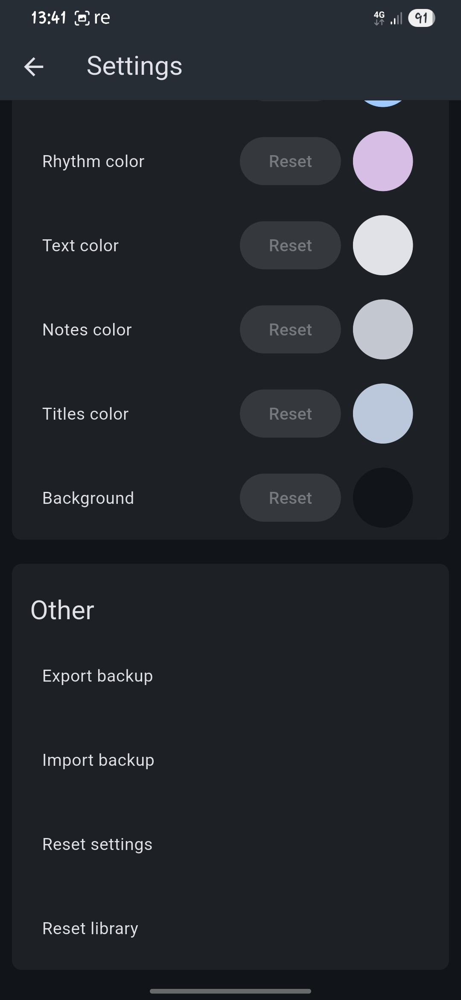
